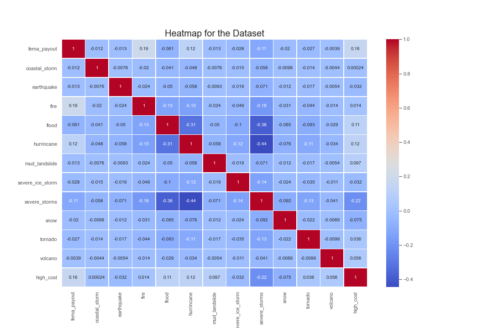
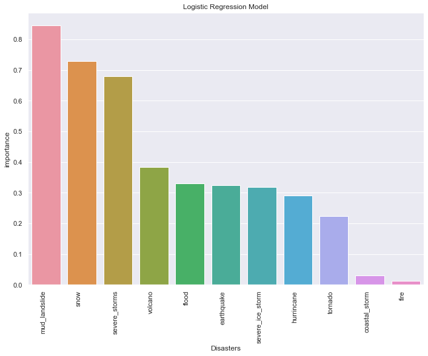
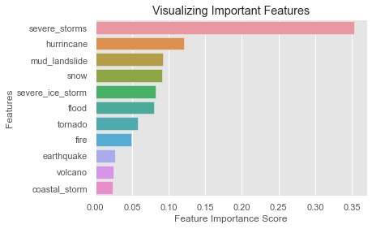

# What is the Most Dangerous State to Live In?
In this project we look into which US State is the most dangerous to live in based on the federally declared natural disasters that have occurred in the last ten years. We decided on ths time frame considering the dataset (FEMA Disaster Declarations Summary) is sufficiently large with over 21,000 records. Based on these records we created a point system to give weight to each disaster and award it with a disaster score. These scores are used to determine which states are the most dangerous to live in.

We also used FEMA's Mission Assignment dataset from the same period, which describes funding sent to the locations of the disasters. This data was used primarily in analysis using machine learning models.

Both of  the datasets that the Team used were found on fema.gov.

FEMA's commentary on the Disaster Declarations Summary dataset:
“The FEMA Disaster Declarations Summary is a summarized dataset describing all federally declared disasters. The dataset lists all official FEMA Disasters Declarations, beginning with the first disaster declaration in 1953 and features all three disaster declaration types: major disaster, emergency, and fire management assistance. The dataset includes declared recovery programs and geographic areas(counties were not available before 1964 and Fire Management records are considered partial due to the historical nature of the dataset). Disaster Declarations Summary-v2 is raw, unedited data from FEMA’s National Emergency Management Information System (NEMIS)”

FEMA's commentary on the Mission Assignment dataset:
“Mission Assignment, as defined in the 44 Code of Federal Regulations, is a work order issued by FEMA to another Federal agency directing completion of a specified task and citing funding, other managerial controls, and guidance. Mission Assignments are essential and powerful tools for federal emergency management under the Stafford Act. Mission Assignments are distinct because they allow for deployment, employment and assistance from the full range of federal resources to support disaster needs.” -FEMA commentary on dataset

## Website and Presentation Slides
- [Website](https://natural-disaster-analysis.herokuapp.com/)
- [Presentation Link](https://docs.google.com/presentation/d/1hf62hA5lI5pDgIPthLenRxxkLpOZf36w3VvTkHR4zUw/edit#slide=id.ge726d615ea_0_0)
 

## ETL
A FEMA-declared disaster dataset with over 21,000 records since 2010 was used as our primary source. Coordinates (lat, lon) for each disaster record were retrieved with functions created using GeoPy. This updated dataset was then cleaned and loaded to a PostgreSQL database that can run multiple times in succession and will replace current values if they exist.

## Flask
A Flask application is used to select data from the database and generate a JSON file to be called through our API. Each disaster record has a unique ID and includes data for date, year, state, county, latitude, longitude, disaster type, and disaster description.

The API interfaces with our JS and is used as the primary source of data revealed in the user-facing application.

## Machine Learning
To provide additional context to our findings, machine learning was applied to the dataset to discover any correlations that exist between the disaster records and FEMA's payout records for each of those disasters. Very little correlation was found. The images below describe the importance of the various features (e.g. disaster types) in our machine learning models. Logistic Regression and Random Forest were our chosen ML tools.

This heatmap from our logistic regression model shows there are no strong relationships between our features.

The Logistic Regression model shows that the top three disaster types according to feature importance are mud/landslides, snow, and severe storms. These disaster types give the greatest weight to the model.

Based on Random Forest, the top three features are severe storms, hurricanes, and snow.

## Application
The JavaScript library Leaflet along with Mapbox is used to create an interactive map centered on the United States. Users can select from a variety of disaster types--earthquakes, tornadoes, wildfires, hurricanes, floods, severe ice storms, mud/landslides, and tsunamis--to reveal map markers showing where they have been concentrated over the past ten years. Tooltips allow users to gain more information on individual FEMA-declared emergencies.

To determine which State is the most dangerous to live in, each disaster record is given an arbitrary point value of one. Without significantly more data on casualties, property damage, and physical power of the disaster event itself, we determined it is safest to assume that all disaster records are equal. This point value is divided by one-thousandth of the state's area in square miles to determine a final 'Disaster Score'.

Using this formula, the top 5 most dangerous states by disaster score are:

- Louisiana: 16.61
- Georgia: 12.84
- South Carolina: 12.43
- North Carolina: 11.97
- Virginia: 11.69

Because this points system is somewhat arbitrary, where each disaster type receives equal weight, we have included a way for users to create their own formula. For each disaster type, you can change the base point value between 0 and 5. The table of States is then updated with the new point values.

For example, if a user thinks earthquakes are much more dangerous than other disasters, they might give it a weight of 5. Alternatively, if they don't think ice storms should be included, they could set its point value to 0, and those records would not be counted toward a State's danger level.

Other formulas that may give interesting results include those where only a single disaster type receive points, while all others are set to 0. This formula shows to an extent States where people have been most in danger from that disaster type over the past ten years.

To dig deeper into each State's disaster statistics, users can click on a table row to discover more.

The entire application is implemented using Heroku.

## Tableau
Our Dashboard page provides users with an alternative way to engage with the disaster data. Using Tableau's visualization tools, you can move between data points for a few disaster types with ease and speed. Breakdowns of disaster type by year are also provided.

## Conclusion
This project provides compelling data about which States experience the greatest amount of severe and costly disasters. While more data--such as the severity of storms--would greatly improve our models and formulas, we believe the outcomes presented here serve as a useful estimate of danger level from natural disasters in the United States.